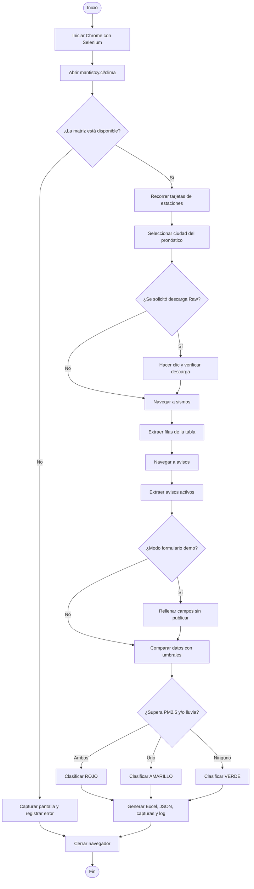

# Diagrama de flujo de la automatización

La plataforma es pública y no solicita credenciales. Por ello, el paso de
“inicio de sesión” se reemplaza correctamente por la apertura de una sesión de
navegador y la validación de acceso al sitio.

## Mapa resumido

**Apertura y validación → navegación → extracción/carga → validación de
umbrales → reporte y evidencias → cierre seguro.**

